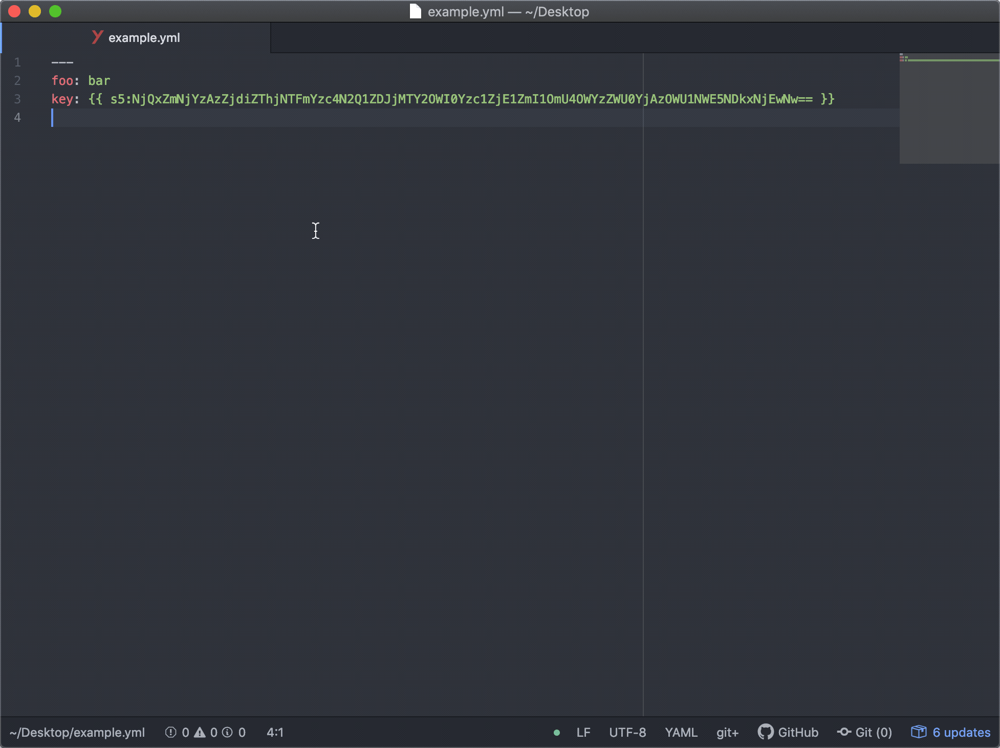
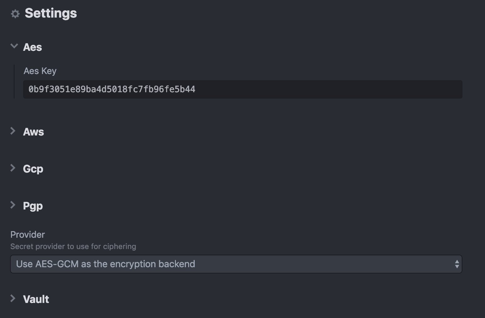

# atom-s5

This is a [atom](https://atom.io/) extension for [s5](https://github.com/mvisonneau/s5)

## Installation / Configuration

Once you have [installed the extension](https://atom.io/packages/s5), you will need to configure the [secret provider](https://github.com/mvisonneau/s5#encryption-backends-supported) you want to use.

